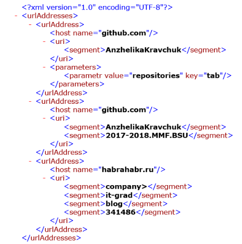

# NET.W.2017.Astapchik.16
EPAM training day 16 homework
В текстовом файле построчно хранится информация о URL-адресах, представленных в виде &lt;scheme>://&lt;host>/&lt;URL‐path>?&lt;parameters>, где сегмент parameters - это набор пар вида key=value, при этом сегменты URL‐path и parameters  или сегмент parameters могут отсутствовать. 
Разработать систему типов (руководствоваться принципами SOLID) для экспорта данных, полученных на основе разбора информации текстового файла, в XML-документ по следующему правилу, например, для текстового файла с URL-адресами 
  
https://github.com/AnzhelikaKravchuk?tab=repositories 

https://github.com/AnzhelikaKravchuk/2017-2018.MMF.BSU

https://habrahabr.ru/company/it-grad/blog/341486/ 

результирующим является XML-документ вида (можно использовать любую XML технологию без ограничений).

Для тех URL-адресов, которые не совпадают с данным паттерном, “залогировать” информацию, отметив указанные строки, как необработанные. 
Продемонстрировать работу на примере консольного приложения.
